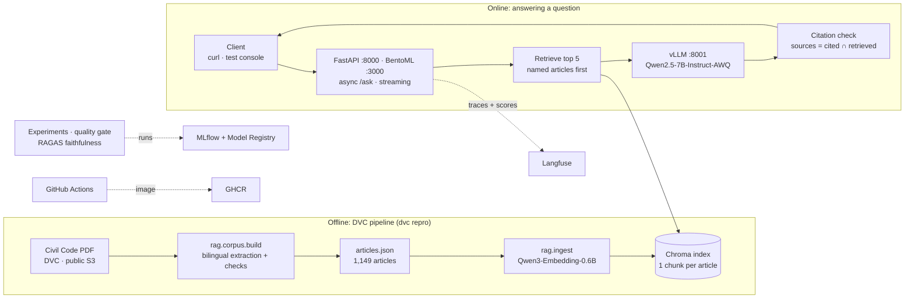

# Egypt Law RAG

[](https://github.com/devahmedhesham-ML/egypt-law-RAG/actions/workflows/ci.yml)

Ask a question about the **Egyptian Civil Code** in Arabic or English and get an answer grounded in the code's own
articles, with every claim cited by article number. ITI × MLOps MENA, Final Project 2 (LLM / RAG).

```text
Q: ما حكم هبة الأموال المستقبلة؟
A: هبة الأموال المستقبلة باطلة، وذلك وفقًا لنص [Article 492].        sources: ["Article 492"]

Q: At what age does a person reach legal majority?
A: … twenty-one years completed in accordance with the Gregorian calendar. [Article 44]   sources: ["Article 44"]
```

**Contents:** [At a glance](#at-a-glance) · [Architecture](#architecture) · [Run it with Docker](#run-it-with-docker) ·
[Operating the containers](#operating-the-containers) · [Troubleshooting](#troubleshooting) · [API](#api) ·
[Where to find the evidence](#where-to-find-the-evidence-rubric-map) · [Known limitations](#known-limitations) ·
[Repository layout](#repository-layout) · [Development setup](#development-setup-wsl-ubuntu--cuda) · details:
[corpus](#corpus-and-index), [LLM](#llm-inference), [evaluation & MLflow](#evaluation-set-and-chunking-experiments-mlflow),
[serving](#serving-bentoml-streaming-load-test-canary), [CI/CD](#cicd-github-actions), [tracing](#tracing-langfuse),
[console](#test-console), [data](#data) · [Project history](#project-history)

## At a glance

| | |
|---|---|
| Corpus | Egyptian Civil Code (Law 131 of 1948), official bilingual PDF → **1,149 articles** (1,093 in force, 56 repealed), Arabic + English, with the part/book/chapter/section hierarchy |
| Retrieval | One bilingual chunk per article, embedded with **Qwen/Qwen3-Embedding-0.6B**, stored in **Chroma**; articles named in the question ("Article 505", "المادة 801") are looked up directly and put first; top 5 whole articles go to the model |
| Generation | **Qwen/Qwen2.5-7B-Instruct-AWQ served by vLLM**; answers only from the retrieved articles, cites them as `[Article N]`, declines when they don't cover the question; a citation check keeps only articles that were actually retrieved |
| Quality | On 58 in-scope evaluation questions: right article ranked first **74%**, in the top 5 **93%**; RAGAS faithfulness **0.79–0.81** (CI gate: ≥ 0.75) |
| Serving | FastAPI (Docker, port 8000) and BentoML (port 3000), async, with token streaming; 50 concurrent users: p95 **12 s**, 0 failures, on one RTX 4070 Ti SUPER |
| MLOps | DVC (data + pipeline, public S3 remote), MLflow (experiments + Model Registry), GitHub Actions (lint → test → index → image → quality gate), Langfuse (tracing), Locust, canary rollout |

## Architecture



The API, BentoML, the experiments and the CI gate all go through the same code path,
[src/rag/pipeline.py](src/rag/pipeline.py): retrieve → answer → check citations.

## Run it with Docker

### What you need

| | |
|---|---|
| Docker | Docker Engine + Compose **v2.24 or newer** (Linux), or Docker Desktop with the WSL 2 backend (Windows) |
| GPU | NVIDIA GPU, **16 GB VRAM recommended** (tested on an RTX 4070 Ti SUPER 16 GB; vLLM reserves 60% of it) |
| GPU in Docker | NVIDIA driver **580 or newer** (CUDA 13); on Linux also the NVIDIA Container Toolkit. Check: `docker run --rm --gpus all nvidia/cuda:12.6.3-base-ubuntu24.04 nvidia-smi` must list your GPU |
| Disk | about **20 GB free** (vLLM image 8.0 GB, API image 2.6 GB, model 5.6 GB): see [What's in the images](#whats-in-the-images) |
| Memory | 16 GB RAM (the two containers use ~5 GB) |
| Network | only for the first start (images, corpus and model downloads); no API keys needed |

### Three commands

```bash
git clone https://github.com/devahmedhesham-ML/egypt-law-RAG.git && cd egypt-law-RAG
cp .env.example .env         # optional keys (Langfuse tracing, Bedrock); the default setup needs none
docker compose up --build    # vLLM (Qwen2.5-7B on the GPU) + the API on http://localhost:8000
```

**What the first start does** (later starts take ~90 s):

1. builds the API image (~8 min): installs CPU-only dependencies, pulls the corpus and Chroma index pinned in
   `dvc.lock` from the public S3 bucket (no AWS account or DVC install needed) and bakes in the embedding model.
   To skip the build, use the image CI publishes: see [Use the prebuilt image](#use-the-prebuilt-image);
2. downloads the project's vLLM image (~3.9 GB; 8.0 GB on disk: vLLM, PyTorch and its CUDA libraries, nothing else);
3. downloads Qwen2.5-7B-Instruct-AWQ (~5.6 GB) into the `hf-cache` volume, kept for later starts;
4. vLLM loads the model (~80–90 s); the API reports healthy a few seconds later.

**It is ready when** `docker compose ps` shows both services `healthy` and `curl localhost:8000/health` returns
`{"status":"healthy","documents_indexed":1149}`. Until vLLM is up, `/health` already works and `/ask` answers 503 with
the reason.

### Try it

```bash
curl localhost:8000/health
curl -X POST localhost:8000/ask -H 'Content-Type: application/json' -d '{"question": "ما حكم هبة الأموال المستقبلة؟"}'
curl -X POST localhost:8000/ask -H 'Content-Type: application/json' -d '{"question": "What is the penalty for theft?"}'   # declines
curl -N -X POST localhost:8000/ask/stream -H 'Content-Type: application/json' -d '{"question": "What is a lease?"}'   # streams
curl -X POST localhost:8000/ask -H 'Content-Type: application/json' -d '{"question": ""}'                            # 422
```

Windows PowerShell: use `curl.exe` (plain `curl` is an alias of `Invoke-WebRequest`) and send the request from a file,
because Arabic typed on the command line gets mangled. Example files are in [examples/](examples/):

```powershell
curl.exe -X POST http://localhost:8000/ask -H "Content-Type: application/json" --data-binary "@examples/ask_ar.json"
Invoke-RestMethod -Uri http://localhost:8000/ask -Method Post -ContentType "application/json; charset=utf-8" -InFile examples/ask_en.json
```

Interactive API docs (try every endpoint from the browser): **http://localhost:8000/docs**.

Expected speed on the test machine: the first answer after a start ~1.6 s (warm-up), then ~0.3–1 s per question,
depending on answer length.

## Operating the containers

| Service | Port | What it is |
|---|---|---|
| `api` | 8000 | FastAPI app: `/ask`, `/ask/stream`, `/health`, `/docs`. CPU only; the corpus, Chroma index and embedding model are inside the image |
| `vllm` | 8001 | vLLM's OpenAI-compatible server for Qwen2.5-7B-Instruct-AWQ, on the GPU |

```bash
docker compose up -d                 # start in the background
docker compose ps                    # status; both become "healthy"
docker compose logs -f vllm          # model loading, request throughput
docker compose logs -f api           # requests and errors
docker compose restart api           # restart the API only
docker compose down                  # stop and remove containers; the downloaded model stays in the hf-cache volume
docker compose down -v               # also delete the model volume (downloaded again next time)
docker rmi ghcr.io/devahmedhesham-ml/egypt-law-rag-vllm:0.30.0 egypt-law-rag-api:latest   # reclaim ~11 GB of images
```

### What's in the images

Only what the system needs to answer: no CUDA toolkit, no kernels for other GPUs, no multi-node libraries.

| Image | Download | On disk | Contents |
|---|---|---|---|
| `ghcr.io/devahmedhesham-ml/egypt-law-rag-vllm:0.30.0` ([Dockerfile.vllm](Dockerfile.vllm)) | ~3.9 GB | 8.0 GB | Python 3.12 slim; gcc (Triton compiles its kernel launcher with it; vLLM fails to start without it); `requirements-serve.lock`: vLLM 0.30.0, PyTorch 2.13 with its CUDA 13 libraries (cuBLAS, cuDNN, NCCL, …), Triton. The video/audio packages vLLM pulls in are removed (a text model never imports them) |
| `egypt-law-rag-api` ([Dockerfile](Dockerfile)) | ~1.4 GB | 2.6 GB | Python 3.12 slim; CPU-only PyTorch, sentence-transformers, Chroma, FastAPI; Qwen3-Embedding-0.6B (1.2 GB, so the API starts offline); the corpus and Chroma index (26 MB) |
| `hf-cache` volume | 5.6 GB | 5.6 GB | Qwen2.5-7B-Instruct-AWQ (4-bit weights), downloaded on the first start. Outside the image, so a new image does not download the model again |

**Why not the official `vllm/vllm-openai` image:** it is 21.6 GB (8.7 GB to download) because it is built for every
NVIDIA GPU and for serving across machines. Measured inside it: 6.4 GB of FlashInfer kernels for Blackwell data-center
GPUs, the 2.8 GB CUDA compiler toolkit, a 1.5 GB kernel cache, 1 GB of multi-node libraries (Mooncake, NIXL, LMCache,
DeepEP), ffmpeg and OpenCV. None of it runs here: on Ampere/Ada GPUs vLLM uses FlashAttention, and greedy decoding
does not need FlashInfer's sampler. The project's image installs exactly the environment of `scripts/serve_vllm.sh`.
On the test machine it gives the same answers, word for word, as the official image did (`scripts/curl_checks.sh`),
faithfulness 0.79–0.80 on the 20 CI questions (the range measured before; between runs the 7B judge scores one question
differently) and the same latency at 50 concurrent users as the earlier load test (`/ask` p95 12 s, 0 failures).
It is tested on an Ada GPU (RTX 4070 Ti SUPER); on a GPU it does not support, `VLLM_IMAGE=vllm/vllm-openai:v0.30.0 docker compose up` uses the
official image with the same command. CI rebuilds it only when `Dockerfile.vllm` or `requirements-serve.lock` changes
([.github/workflows/vllm-image.yml](.github/workflows/vllm-image.yml)).

### Use the prebuilt image

CI builds the API image from every commit on `main` and publishes it (public, no login):

```bash
docker pull ghcr.io/devahmedhesham-ml/egypt-law-rag-api:latest
docker tag ghcr.io/devahmedhesham-ml/egypt-law-rag-api:latest egypt-law-rag-api:latest
docker compose up -d --no-build
```

### Configuration

Set these in `.env` (compose reads it if present) or on the command line:

| Variable | Default | What it does |
|---|---|---|
| `LLM_BACKEND` | `vllm` | `vllm` (main) or `bedrock` (optional) |
| `API_VLLM_URL` | `http://vllm:8001/v1` | where the API container finds vLLM; a vLLM on the host: `http://host.docker.internal:8001/v1` (`VLLM_BASE_URL` in `.env` is for running outside Docker and is ignored by compose) |
| `VLLM_IMAGE` | `ghcr.io/devahmedhesham-ml/egypt-law-rag-vllm:0.30.0` | the vLLM server image; `vllm/vllm-openai:v0.30.0` for the official one (21.6 GB) |
| `HF_CACHE` | `hf-cache` (volume) | where the `vllm` service keeps the model; a host directory keeps it outside Docker |
| `LANGFUSE_PUBLIC_KEY`, `LANGFUSE_SECRET_KEY`, `LANGFUSE_BASE_URL` | unset | optional tracing; without them tracing is off |
| `Bedrock_API_key`, `OPENAI_BASE_URL` | unset | only for `LLM_BACKEND=bedrock` |
| `APP_RELEASE` | the image's git commit | value of the `X-Release` response header (canary rollouts) |
| `RAG_WARMUP` | `true` | load the embedding model at start instead of on the first question |
| `GIT_SHA` (build argument) | `unknown` | commit recorded in the image as its release |

The vLLM flags (`--gpu-memory-utilization 0.60 --max-model-len 8192`) are in [docker-compose.yml](docker-compose.yml);
lower the first on a GPU that is shared or smaller than 16 GB.

### Variants

```bash
API_VLLM_URL=http://host.docker.internal:8001/v1 docker compose up api    # vLLM already running on the host (scripts/serve_vllm.sh)
LLM_BACKEND=bedrock docker compose up api                                 # no GPU: optional Bedrock backend, key in .env
```

## Troubleshooting

| Symptom | Cause and fix |
|---|---|
| `could not select device driver "" with capabilities: [[gpu]]` / vLLM exits at start | Docker cannot see the GPU. Install the NVIDIA Container Toolkit (Linux) or use Docker Desktop with WSL 2 (Windows), then check with the `nvidia/cuda … nvidia-smi` command above |
| vLLM logs `CUDA out of memory` | other programs use the GPU; free it, or lower `--gpu-memory-utilization` in `docker-compose.yml` |
| `/ask` returns 503 `LLM unavailable: vllm: server not reachable` | vLLM is still loading (wait until `docker compose ps` shows it healthy) or stopped (`docker compose logs vllm`) |
| `/health` returns 503 `unhealthy` | the image has no index; rebuild it (`docker compose build api`) or use the prebuilt image |
| `port is already allocated` (8000 or 8001) | another server uses the port; stop it, or change the `ports:` mapping in `docker-compose.yml` |
| the first start takes long | it downloads ~11 GB (vLLM image, API image, model); later starts take ~90 s |
| vLLM exits with `CUDA driver version is insufficient` | the images use CUDA 13: update the NVIDIA driver to 580 or newer |
| build fails at `dvc pull` | no access to the public S3 bucket from your network; use the prebuilt image instead |
| Arabic comes back as `????` in PowerShell | send the question from a file (`--data-binary @examples/ask_ar.json`); the console's display encoding does not affect the answer |
| Docker Desktop fails after the disk filled up | free space on the drive holding Docker's data (C: on Windows), quit Docker Desktop, run `wsl --shutdown`, start it again; keep ≥ 20 GB free |

## API

| Endpoint | Request → response |
|---|---|
| `POST /ask` | `{"question": str}` → `{"answer": str, "sources": ["Article 492", ...]}`: the articles the answer cites that were in its retrieved context (top 5). Empty, blank or missing question → **422**. LLM or index unavailable → 503 with the reason. Langfuse trace id in the `X-Trace-Id` header (when tracing is on). |
| `POST /ask/stream` | same request; the answer as plain text, token by token (`curl -N` shows it arriving), then `Sources: ...` |
| `GET /health` | `{"status": "healthy", "documents_indexed": 1149}`, or 503 `unhealthy` without an index |
| `GET /docs` | interactive OpenAPI documentation |

Handlers are async: retrieval runs in a worker thread and the call to vLLM is awaited. Every response carries an
`X-Release` header (the build). [reports/curl_checks.md](reports/curl_checks.md) holds a real run of every case against
`docker compose up`; regenerate it with `scripts/curl_checks.sh > reports/curl_checks.md`. Outside Docker:
`python -m rag.api` (app venv, port 8000). The image installs only `requirements-api.lock` (CPU torch).

## Where to find the evidence (rubric map)

| # | Area | Status | Where to look |
|---|---|---|---|
| R01 | Code & packaging | ✅ | `pyproject.toml`, `src/rag/` (`pip install -e .`); 95 tests in `tests/` |
| R02 | API endpoint | ✅ | [src/rag/api/app.py](src/rag/api/app.py) (async, Pydantic); 422 / health / answers in [reports/curl_checks.md](reports/curl_checks.md) |
| R03 | Docker | ✅ | [Dockerfile](Dockerfile), [Dockerfile.vllm](Dockerfile.vllm), [docker-compose.yml](docker-compose.yml), the three commands above; verified with vLLM in compose on 2026-10-08 ([what's in the images](#whats-in-the-images)) |
| R04 | MLflow tracking | ✅ | 8 runs: [reports/chunking_experiments.md](reports/chunking_experiments.md), [compare screenshot](reports/mlflow_chunking_compare.png); `civil-code-retrieval` with alias `production`: [registry screenshot](reports/mlflow_registry_production.png) |
| R05 | DVC | ✅ | [dvc.yaml](dvc.yaml), [dvc.lock](dvc.lock): `git checkout` + `dvc pull` + `dvc repro` (public remote) |
| R06 | GitHub Actions CI/CD | ✅ | [.github/workflows/ci.yml](.github/workflows/ci.yml); PR #1 merged with all checks green; image on GHCR; quality gate: [reports/faithfulness_gate.md](reports/faithfulness_gate.md) |
| R07 | Production serving | ✅ | BentoML [src/rag/serving/service.py](src/rag/serving/service.py) + vLLM; Locust: [reports/locust_summary.md](reports/locust_summary.md), [locust_report.html](reports/locust_report.html); canary: [reports/canary_test.md](reports/canary_test.md); batch re-indexing: [reports/batch_reindex.md](reports/batch_reindex.md) |
| R08 | Monitoring | 🟡 | Langfuse traces every request (cloud); RAGAS faithfulness in MLflow (experiments + `faithfulness-gate`). Grafana panel, alert and self-hosted Langfuse: not yet |
| R09 | Peer review | — | submitted outside the repository |
| R10 | README & architecture | ✅ | this README: three-command setup, [architecture](#architecture), [project history](#project-history) |

Progress against the handbook's checklist is tracked in [TASKS.md](TASKS.md).

## Known limitations

- **Answer quality of a 7B model.** Qwen2.5-7B sometimes reaches a wrong legal conclusion or drifts into Chinese in
  the middle of an Arabic answer; the citation check catches invented article numbers, not wrong reasoning.
- **Evaluation set.** 62 questions written from the article texts and accepted as the project's set, but not reviewed by
  a legal expert; with 58 in-scope questions, one question moves a metric by 0.017
  ([docs/evaluation-dataset.md](docs/evaluation-dataset.md)).
- **The faithfulness judge is the same 7B model.** Its per-question scores are noisy (it disagreed with a 120B judge on
  half of the gate questions); its averages are usable ([reports/judge_comparison.md](reports/judge_comparison.md)).
- **Latency under load** is set by vLLM's generation speed on one consumer GPU (~460 tokens/s shared by all requests):
  p95 12 s at 50 concurrent users.
- **Declining** out-of-scope questions relies on the model following the prompt; there is no similarity threshold yet.
- **Monitoring** (R08) is partly done: Langfuse runs on Langfuse Cloud; Grafana, the alert and self-hosting are pending.
- **The CI quality gate** needs a self-hosted GPU runner online; with the repository variable `GPU_RUNNER=false` it is
  skipped.
- **No authentication or rate limiting** on the API: it is meant for local and demo deployments.

## Repository layout

```text
src/rag/
  corpus/        PDF → structured, validated articles (rag.corpus.build)
  ingest/        chunking, GPU embedding, Chroma; batch re-indexing; index fallback (ensure)
  retrieval.py   question → top-k articles (named articles first)
  llm/           OpenAI-compatible client for vLLM / Bedrock, prompt, citation check
  pipeline.py    retrieve → answer → check citations (shared by API, BentoML, evaluation)
  api/           FastAPI app (the Docker image)
  serving/       BentoML service
  evaluation/    RAGAS faithfulness and the CI quality gate
  experiments/   chunking experiments, report, Model Registry
  ui/            local test console
  tracing.py     Langfuse configuration
eval/            evaluation questions (62) and their generator
tests/           pytest suite (CPU only, no network)
reports/         evidence: curl checks, experiments, MLflow screenshots, Locust, canary, gate
deploy/canary/   nginx canary rollout
loadtest/        Locust load test
examples/        request bodies for curl.exe / PowerShell
scripts/         vLLM server, smoke test, CI gate, runner setup
Dockerfile       API image (CPU) · Dockerfile.vllm: vLLM image (GPU) · docker-compose.yml runs both
docs/            corpus build plan, evaluation dataset
data/            DVC-tracked PDF, corpus and index (dvc pull)
```

## Development setup (WSL Ubuntu + CUDA)

Three virtual environments, each built from a lock file, because each one pins a different torch version:

| venv | lock file | used for |
|---|---|---|
| `~/venvs/egypt-law-rag` | `requirements.lock` | app: ingestion, embeddings, Chroma, RAGAS, BentoML, MLflow, DVC, Locust |
| `~/venvs/egypt-law-rag-serve` | `requirements-serve.lock` | `vllm serve` (OpenAI-compatible API) |
| `~/venvs/egypt-law-rag-quantize` | `requirements-quantize.lock` | one-off AWQ-4bit quantization |

```bash
sudo apt install -y build-essential   # C compiler: vLLM/Triton compile GPU kernels at start-up
curl -LsSf https://astral.sh/uv/install.sh | sh
for n in "" -serve -quantize; do
  uv venv --python 3.12 ~/venvs/egypt-law-rag$n
  VIRTUAL_ENV=~/venvs/egypt-law-rag$n uv pip sync requirements$n.lock
done
cp .env.example .env   # fill in optional keys
source ~/venvs/egypt-law-rag/bin/activate
pip install -e . --no-deps
dvc pull               # the PDF, corpus and index (public bucket, no AWS account needed)
pytest                 # unit tests, no GPU or network needed
```

The `requirements*.txt` files state intent. After editing one, regenerate its lock file:

```bash
uv pip compile --python-version 3.12 --python-platform x86_64-manylinux_2_28 requirements.txt -o requirements.lock
# API image and CI: CPU torch, versions constrained to the app lock
grep -vE "^(torch|nvidia-|triton|cuda-)" requirements.lock | grep -E "^[a-zA-Z0-9_.-]+==" > /tmp/constraints.txt
uv pip compile requirements-api.txt -c /tmp/constraints.txt --python-version 3.12 \
  --python-platform x86_64-manylinux_2_28 --torch-backend cpu --no-header -o requirements-api.lock
uv pip compile requirements-ci.txt -c /tmp/constraints.txt --python-version 3.12 \
  --python-platform x86_64-manylinux_2_28 --torch-backend cpu --no-header -o requirements-ci.lock
```

## Corpus and index

Two DVC stages turn the PDF into a searchable index ([dvc.yaml](dvc.yaml), settings in [params.yaml](params.yaml)):

```bash
dvc repro                   # both stages, non-interactive; or run them one at a time:
python -m rag.corpus.build  # PDF → data/processed/articles.json (+ corpus_report.json), ~3.5 s
python -m rag.ingest        # articles → GPU embeddings → data/index/chroma (+ index_report.json), ~30 s
```

**`rag.corpus.build`** reads each column of the bilingual table top to bottom and splits it on its own markers ("Article N", "مادة (n)"), joining the two sides by number; table rows serve as a cross-check. It produces 1,149 records (1,093 live, 56 repealed and flagged) with a numbered, bilingual hierarchy (part > book > chapter > section > topic > subtopic). Arabic is rebuilt from glyph positions: lam-alef ligatures, digit order (confirmed against the English), mirrored brackets and the font's private-use ligatures are repaired. Plan and design: [docs/plans/corpus-build.md](docs/plans/corpus-build.md).

Checks **warn, never stop the build**: Arabic/English numbers, articles cut off at page breaks, paragraph and list sequences, reversed numbers, length ratios, extraction artifacts, and reference articles checked word for word. The current 11 warnings are all defects in the source PDF (e.g. no Arabic "مادة ١٠٢٢"); they are listed in the console's Corpus view and in `corpus_report.json`.

**`rag.ingest`** shows those warnings and asks before continuing (`--yes` for scripts, `--stop-on-warning` to refuse). It embeds one chunk per article (heading path + Arabic + English), so the top 10 hits are always 10 different articles, with `Qwen/Qwen3-Embedding-0.6B`, then writes Chroma and runs smoke queries in both languages.

GPU use: the first replica embeds the longest batch to measure its real footprint, then more replicas start only if they fit in free VRAM minus a 2 GB margin **and** the GPU has idle compute. Measured on an RTX 4070 Ti SUPER (1,149 chunks, 298k tokens):

| Batch budget | Replicas | Embedding | Tokens/s | Peak VRAM |
|---|---|---|---|---|
| 16,384 tokens | 1 | 11.3 s | 26.4k | 7.7 GB |
| 16,384 tokens | 2 | 12.9 s | 23.1k | 11.6 GB |
| 4,096 tokens | 4 | 10.1 s | 29.5k | 11.9 GB |
| **4,096 tokens** | **1** | **8.8 s** | **33.9k** | **4.7 GB** |

One replica already keeps this GPU ~91% busy, so auto mode stays at one; `--replicas N` forces more (always capped at what fits).

**Index maintenance:**

```bash
python -m rag.ingest.ensure                                        # make sure a usable index exists (local → pull → build)
python -m rag.ingest.batch data/samples/batch_test_document.json   # add/replace articles without a rebuild
```

`rag.ingest.batch` embeds only new or changed articles (unchanged ones are skipped, so re-runs are free) and merges
them into the corpus file the API cites from. Tested with a new document in
[reports/batch_reindex.md](reports/batch_reindex.md): a hypothetical Article 1150 on electronic signatures goes from
absent to the top result (0.795) for a matching question after a 0.8 s update.

## LLM inference

One OpenAI-compatible client ([src/rag/llm/](src/rag/llm/)) drives the backends, chosen with `llm.backend` in
[params.yaml](params.yaml) (or `LLM_BACKEND`). **The main model everywhere is Qwen2.5 on vLLM**; Bedrock is an
optional extra:

| backend | server | model |
|---|---|---|
| `vllm` (main) | `vllm serve` on :8001 (`scripts/serve_vllm.sh`, `VLLM_BASE_URL`), or the compose `vllm` service | **`Qwen/Qwen2.5-7B-Instruct-AWQ`** |
| `bedrock` (optional) | Amazon Bedrock's OpenAI-compatible endpoint (`OPENAI_BASE_URL`, key `Bedrock_API_key`) | `openai.gpt-oss-120b` |

The model answers only from the retrieved articles and cites them inline as `[Article 492]`. Every answer is checked: any cited article that was not retrieved is flagged as a hallucination.

```bash
scripts/serve_vllm.sh                         # vLLM (serve venv) on :8001 with the project's flags (GPU share 0.60)
python scripts/llm_smoke.py --backend vllm    # real call: 3 questions, streamed, citations checked
```

## Evaluation set and chunking experiments (MLflow)

[eval/questions.jsonl](eval/questions.jsonl) holds 62 questions: 28 topics from all four books, each asked in Arabic
and in English, plus 2 that name an article by number and 4 out-of-scope questions. Each question lists the articles a
correct answer rests on and a short reference answer. It is the project's **accepted evaluation set** (not reviewed by
a legal expert); 20 of its questions (`"ci": true`) form the CI quality gate. How it was built and its limits:
[docs/evaluation-dataset.md](docs/evaluation-dataset.md).

```bash
python -m rag.experiments.chunking                      # retrieval metrics only, ~5 min for 8 configs (GPU)
python -m rag.experiments.chunking --faithfulness       # + Qwen2.5 answers judged by RAGAS (judge: Qwen2.5)
python -m rag.experiments.chunking --faithfulness-only  # re-score stored rankings, no re-embedding
python -m rag.experiments.chunking --report-only        # rebuild reports/chunking_experiments.md from MLflow
python -m rag.experiments.register                      # register the best config, alias "production"
python -m rag.evaluation.gate                           # the CI quality gate, locally (needs vLLM)
mlflow ui --backend-store-uri sqlite:///mlflow.db       # experiment "chunking" → select runs → Compare
```

Each entry under `experiments.chunking` in [params.yaml](params.yaml) is one MLflow run: a chunking strategy
(`article`, `window` with `chunk_size`/`overlap` in tokens, or `per_language`) and an embedding model. The run builds a
throwaway index under `data/experiments/`, retrieves for every question exactly as production does (articles named in
the question first, then the best chunk per article), and logs:

- params: `strategy`, `chunk_size`, `overlap`, `embedding_model`, `top_k` (tags: `answer_model`, `judge_model`)
- metrics: `hit_at_1`, `hit_at_5`, `recall_at_5`, `mrr`, `ndcg_at_5` (overall, `_ar`, `_en`), `ar_en_top1_agreement`,
  the top-1 similarity for in-scope vs out-of-scope questions, embedding cost and speed, and with `--faithfulness`,
  RAGAS `faithfulness` (Qwen2.5 answers from the top 5 articles; Qwen2.5 judges by default, `--judge-backend bedrock`
  is optional)
- artifact: `per_question.json` with every question's ranking, answer and score

Chunking changes only which articles are retrieved: the model always receives whole articles. Results (8 runs, 58
in-scope questions; one question = 0.017 of hit@1, so treat small gaps as ties):

| Run | hit@1 | recall@5 | MRR | AR/EN same top-1 | faithfulness |
|---|---|---|---|---|---|
| **article, Qwen3-Embedding-0.6B (production)** | 0.741 | 0.931 | 0.819 | 0.607 | 0.813 |
| article, bge-m3 | 0.759 | 0.931 | 0.835 | 0.714 | 0.806 |
| window 512/64, Qwen3 | 0.724 | 0.931 | 0.808 | 0.571 | 0.813 |
| window 256/32, Qwen3 | 0.724 | 0.897 | 0.805 | 0.571 | 0.823 |
| per_language, Qwen3 | 0.655 | 0.897 | 0.767 | 0.357 | 0.813 |
| window 128/16, Qwen3 | 0.466 | 0.690 | 0.567 | 0.393 | 0.741 |

- **Whole articles are the right unit.** Every split retrieves worse; 128-token windows lose the context that makes an
  article findable (hit@1 0.47). Splitting Arabic from English loses the bilingual chunk's help across languages: the
  two versions of a question agree on the top article far less often (0.61 → 0.36).
- **bge-m3 ties Qwen3 on whole articles** (one question apart) and agrees more across languages, but separates
  out-of-scope questions worse: their best match scores 0.49 with bge-m3 against 0.42 with Qwen3 (in-scope: ~0.65
  for both), which matters for a future "no relevant article" threshold.
- **Faithfulness is 0.74–0.84**: mostly within noise, lowest for the config that retrieves worst. The 7B judge is noisy
  per question ([reports/judge_comparison.md](reports/judge_comparison.md)); read its averages, not single scores.
- **Cost is small for every run.** Production's embeddings are 4.5 MB of vectors (a 22.5 MB Chroma index), built in
  about 9 s on the RTX 4070 Ti SUPER with the GPU ~80% busy and one 2.1 GB model copy. Per question, retrieval takes
  ~15 ms to embed on the GPU (~56 ms on the CPU, as in Docker) plus ~10 ms of vector search.
- Production is **article + Qwen3-Embedding-0.6B**, registered in the MLflow Model Registry as
  `civil-code-retrieval` with the alias **`production`** (best recall@5, then within one question of the best hit@1,
  then the largest in-/out-of-scope gap). It loads as `mlflow.pyfunc.load_model("models:/civil-code-retrieval@production")`
  and returns the top-5 article numbers.

## Serving: BentoML, streaming, load test, canary

[src/rag/serving/service.py](src/rag/serving/service.py) wraps the same pipeline in BentoML; vLLM serves the model:

```bash
scripts/serve_vllm.sh                                        # vLLM: Qwen/Qwen2.5-7B-Instruct-AWQ on :8001
bentoml serve rag.serving.service:RagService --port 3000     # async /ask and /ask_stream
curl -N -X POST localhost:3000/ask_stream -H 'Content-Type: application/json' -d '{"question": "ما حكم هبة الأموال المستقبلة؟"}'
```

**Load test** ([loadtest/locustfile.py](loadtest/locustfile.py), 50 concurrent users, 3 minutes, questions from the
evaluation set, 80% `/ask` and 20% `/ask_stream`): **p95 12 s for a full answer, 8.7 s to the first streamed text, 0
failures in 899 requests, 5 requests/s** on one RTX 4070 Ti SUPER; one question alone takes 0.9 s. The limit is vLLM's
generation throughput (~460 tokens/s shared by all answers), not the API. Details, before/after and what would lower
it: [reports/locust_summary.md](reports/locust_summary.md); full report: [reports/locust_report.html](reports/locust_report.html).

### Canary rollout

[deploy/canary/](deploy/canary/) runs two versions of the API behind nginx and splits traffic by weight; every
response carries `X-Release`, and nginx logs which version served each request.

```bash
STABLE_IMAGE=ghcr.io/devahmedhesham-ml/egypt-law-rag-api:<current sha> \
CANARY_IMAGE=ghcr.io/devahmedhesham-ml/egypt-law-rag-api:<new sha> \
  docker compose -f deploy/canary/docker-compose.yml up -d    # entry point: http://localhost:8080
deploy/canary/set_weights.sh 90 10    # 1. 10% of traffic on the canary (reloads nginx, no downtime)
deploy/canary/set_weights.sh 50 50    # 2. widen while it stays healthy
deploy/canary/set_weights.sh 0 100    # 3. promote; or `100 0` to roll back at any step
```

Promote only while the canary matches stable on: 5xx rate (nginx log, `release=canary`), p95 latency (rerun Locust
against :8080), and answer quality, meaning the faithfulness gate run against the canary image and its Langfuse
scores (`citations_outside_context`, tester ratings) filtered by `environment=canary`. A canary that stops answering
leaves rotation automatically (`max_fails`). Tested end to end (90/10 → 270/30 requests, 50/50, promote, roll back,
canary crash with no failed request): [reports/canary_test.md](reports/canary_test.md).

## CI/CD (GitHub Actions)

[.github/workflows/ci.yml](.github/workflows/ci.yml) runs on every pull request and on `main`:

1. **lint**: `ruff check .` (rules in `pyproject.toml`)
2. **test**: `pytest` on CPU (`requirements-ci.lock`)
3. **index**: `python -m rag.ingest.ensure`: use the local index, else `dvc pull` it from the public remote, else
   build it (corpus first if missing), then a retrieval smoke test
4. **docker**: build the API image and push it to GHCR (`ghcr.io/devahmedhesham-ml/egypt-law-rag-api`), tagged with the
   commit, the PR and `latest` on `main`
5. **quality-gate**: `scripts/ci_gate.sh` → `python -m rag.evaluation.gate`: RAGAS faithfulness of the production system
   (Qwen2.5 on vLLM) on the 20 CI questions; **fails below 0.75**. It needs the GPU, so it runs on a self-hosted runner
   labelled `gpu` (`scripts/setup_gpu_runner.sh`, then `~/actions-runner/run-gpu.sh`), only when the repository variable
   `GPU_RUNNER` is `true`, and never for pull requests from forks. Last result: [reports/faithfulness_gate.md](reports/faithfulness_gate.md).

[.github/workflows/vllm-image.yml](.github/workflows/vllm-image.yml) builds the vLLM image from
[Dockerfile.vllm](Dockerfile.vllm), checks that vLLM and PyTorch import, and pushes it to GHCR
(`ghcr.io/devahmedhesham-ml/egypt-law-rag-vllm:<vLLM version>`), only when `Dockerfile.vllm` or
`requirements-serve.lock` changes (or on demand).

## Tracing (Langfuse)

Set `LANGFUSE_PUBLIC_KEY`, `LANGFUSE_SECRET_KEY` and `LANGFUSE_BASE_URL` in `.env` (see `.env.example`); without them, or
with `LANGFUSE_TRACING_ENABLED=false` (set by the tests), tracing is a no-op. Configuration lives in
[src/rag/tracing.py](src/rag/tracing.py): environment `development` unless `LANGFUSE_TRACING_ENVIRONMENT` is set (the
Docker image uses `docker`), and the git commit as the release.

| Trace | Steps (observation type) | Scores |
|---|---|---|
| `answer-question` (API, BentoML, console Ask/Compare, `scripts/llm_smoke.py`) | `retrieve-articles` (retriever) → `embed-question` (embedding), `generate-answer` (generation: prompt, model, tokens, time to first token, reasoning), `check-citations` (evaluator) | `citations_outside_context`, `answer_has_citations`, `tester_rating`, `tester_issue` |
| `search-articles` (Retrieval view) | `retrieve-articles` → `embed-question`; `load-embedding-model` on the first search | |
| `index-corpus` (`python -m rag.ingest`) | `check-corpus`, `embed-chunks` (embedding, token usage), `write-index`, `run-smoke-queries` (evaluator) | `corpus_warnings`, `smoke_top1_rate` |
| `build-corpus` (`python -m rag.corpus.build`) | `extract-pages`, `validate-records` | `build_warnings` |

Console traces carry the tab's session id and tags (`ask`/`compare`, backend, context mode); the two traces of one
Compare run share a `group_id` in their metadata. Errors (e.g. vLLM down, an expired key) are ERROR-level; a Stop press
is a WARNING with the partial answer kept.

## Test console

A local web UI for manual and user testing (`src/rag/ui/`):

```bash
python -m rag.ui          # app venv, from the repo root -> http://localhost:7860
```

| View | What it does |
|---|---|
| Ask | Streamed answer from vLLM (main) or Bedrock (optional); context retrieved from the index per question (top-k, articles named by number first) or picked by hand; citations are clickable and checked against the context |
| Compare | Same question and context on both backends side by side, with a latency/tokens/citations summary |
| Status | Live health of every pipeline stage (corpus, index, vLLM, API, MLflow, Langfuse); planned stages are listed so gaps stay visible |
| Corpus | All 1,149 articles with their bilingual hierarchy and source pages, the build's warnings, and a "Random 20" eyeball check |
| Retrieval | Search the index directly: ranked articles with similarity scores, hierarchy and text |
| Traces | Every answer and search from this tab, with a link to its Langfuse trace (one tab = one Langfuse session) |
| Evaluation | Planned: what it will test, what it needs first, and a preview of its layout |
| Feedback log | Every tester rating (right/wrong, reason tags, comment) from `data/feedback/feedback.jsonl`, downloadable; ratings are also scored on the answer's trace |

## Data

`data/raw/egyptian_civil_code.pdf` is tracked with DVC: git stores only the `.dvc` pointer file, and the PDF itself lives
in S3 (`s3://amzn-egypt-law-rag/dvc`, eu-north-1). The pipeline outputs (`articles.json`, the Chroma index) are
DVC-tracked the same way through `dvc.lock`; their reports are small and committed to git.

The `dvc/` prefix of the bucket is publicly readable, so anyone can `dvc pull` without an AWS account. Only the owner
can write (`dvc push`), using `aws login`: install AWS CLI v2 inside WSL and share one login with Windows:

```bash
ln -sfn /mnt/c/Users/<you>/.aws ~/.aws   # reuse the Windows ~/.aws
aws login
dvc push
```

## Project history

| Date | Milestone |
|---|---|
| 2026-09-27 | Repository, DVC on a public S3 remote, split and locked environments; LLM layer (vLLM + Bedrock); test console |
| 2026-09-28 | Corpus build (1,149 bilingual articles, 11 source warnings) and GPU embedding into Chroma; retrieval in the console; Langfuse tracing |
| 2026-09-29 | Production API (`/ask`, `/health`, 422) and Docker image; evaluation set; chunking strategies and 8 MLflow runs |
| 2026-09-30 | Experiment report with cost, speed and hardware; evaluation dataset documented |
| 2026-10-07 | Qwen2.5 on vLLM as the main model; async API with streaming; faithfulness quality gate; Model Registry; BentoML; Locust; batch re-indexing; canary; CI/CD (PR #1 merged green) |
| 2026-10-08 | `docker compose up` with vLLM and the canary rollout verified end to end; the project's own vLLM image (8.0 GB instead of 21.6 GB), same answers and latency, faithfulness 0.79–0.80 |
